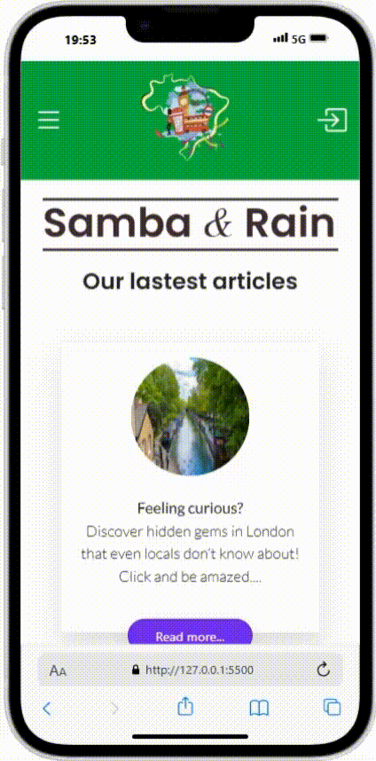
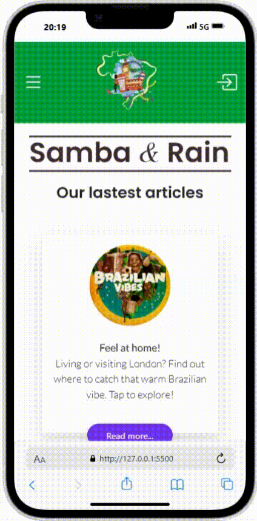

# Samba & Rain — A Web Guide for the Brazilian Community

**Samba & Rain** is a web-based application designed to serve both Brazilian tourists and residents in the UK capital. Inspired by the growing demand for cultural familiarity, practical guidance, and useful services, this project aims to help users discover everything from local shops and restaurants to churches, currency rates, and career stories — all tailored to the Brazilian community.

Whether you're visiting London for the first time or living here long-term, this project connects you to a network of Brazilian-owned businesses, community spaces, and tools to help you navigate the city with confidence.

---
## 📱 Mobile First Approach
This project was designed and developed using a Mobile First methodology. That means the entire experience is optimized primarily for mobile devices — ensuring fast loading, touch-friendly interactions, and responsive layouts tailored for smaller screens.

**To best view the website:**

* Open it on your mobile device or

* Use your browser's developer tools and switch to a mobile view.

* You can also use extensions like "Mobile View Switcher" on Google Chrome for convenience

This ensures the full visual identity, layout, and UX choices are seen the way they were intended.

## 🧭 Project Highlights

### 📰 Articles
Features cultural and practical blog posts about life in London from a Brazilian perspective.

### 💱 Live Currency Exchange
Using **TransferWise's API**, the site fetches real-time exchange rates between the British Pound (GBP) and Brazilian Real (BRL), allowing users to plan their finances effectively.

### 🧮 Salary Calculator
A simple but effective calculator that helps estimate UK earnings and compare them to Brazilian standards.

### 🛍️ Favorite Brazilian Shops & Markets
Interactive lists and logos of local stores and markets that are popular among Brazilians.

### 🗺️ Maps by Category
Using **Leaflet.js**, the site dynamically displays interactive maps for:
- Restaurants
- Pubs
- Markets
- Salons
- Churches

Each location is loaded via external **JSON** files, with marker data including name, image, URL, and precise geolocation (latitude & longitude). The markers are clickable and open popups with more information.

### 🧑‍💼 Testimonials
Fictional stories of Brazilians who moved to London and found new career paths or started businesses. This section is aimed at inspiring others to explore similar journeys.

---

## 🚀 Features & Functionality

- Fully responsive UI with **Bootstrap 5.3**
- Smooth, animated carousels with **Slick Carousel**, **Swiper.js**, and **Owl Carousel**
- Animated icons and effects using **Anime.js**
- Dynamically rendered content using **Vanilla JavaScript**
- Modular data structure with **external JSON files**
- Clean layout and SEO-friendly page structures
- Organized in multiple themed sections/pages:
  - `index.html` – homepage
  - `about.html` – about the project
  - `places.html` – maps and locations
  - `testimonials.html` – success stories

---

## 📦 Technologies & APIs Used

| Technology        | Purpose |
|-------------------|---------|
| **HTML5/CSS3**    | Core structure and styling |
| **JavaScript**    | Interactivity and data handling |
| **Leaflet.js**    | Dynamic map rendering |
| **OpenStreetMap** | Free and customizable map tiles |
| **TransferWise API** | Real-time currency conversion |
| **JSON**          | External data for places and coordinates |
| **Swiper.js**     | Interactive sliders |
| **Slick Carousel**| Logos and testimonial carousels |
| **Owl Carousel**  | Mobile-friendly carousels |
| **Anime.js**      | Subtle animations and transitions |
| **Bootstrap 5.3** | Grid and responsive layout |
| **jQuery**        | Carousel integrations and DOM manipulation (where needed) |

---

## ✨ Final Thoughts
This project is more than just a website — it’s a cultural bridge and a digital community hub for Brazilians in London. Whether someone is planning a trip, settling in, or simply looking for the best place to get feijoada or attend a church service, this app was built to guide and inspire.

## 🤝 Contributions & Feedback
If you'd like to suggest a feature, correct data, or contribute new businesses to the map, feel free to fork the project, submit a pull request, or open an issue.
